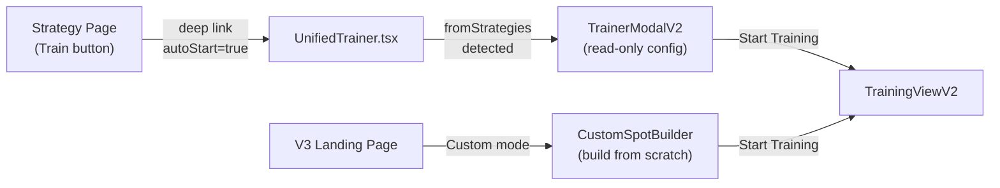

# Trainer V3 Landing Page Revamp Plan

## Current State

**Trainer V1** (direct Trainer tab, staging): `components/Trainer/TrainerModal.tsx` + `useTrainer.tsx`
**Trainer V2** (from Strategy, staging): `components/StrategyElements/Train.tsx` + `components/Trainer/TrainerModalV2.tsx`
**Trainer V3** (feature/trainerv3): `components/UnifiedTrainer/TrainerLanding.tsx` + `UnifiedTrainer.tsx`

The V3 landing page was built optimistically and dropped critical guards that V1/V2 had. This plan bridges all gaps.

---

## Architecture Decision: Mode 2 Dual Entry Points

Mode 2 (Custom) has two entry points. Each preserves its source UI:




- **Entry A (from Strategy)**: Detect `autoStart + custom action sequence in Redux` in `UnifiedTrainer.tsx`. Instead of jumping straight to training, show `TrainerModalV2` so the user sees the familiar V2 config review + action chips. Reuse the existing component.
- **Entry B (V3 Landing)**: Keep `CustomSpotBuilder` as-is for building from scratch, but add V2-compatible validation before start.

---

## Part 1: Mode 1 (Preflop) - V1 Parity

Mode 1 is already close to V1. Key gaps to fix:

### 1.1 Config Load Error UI (Gap #1)

- **V1**: `waitForTrainerConfig()` polls 5s, shows error and blocks start if it fails.
- **V3**: `trainerConfigError` is selected (line 342) but **never rendered**. User sees disabled button with no explanation.
- **Fix**: In `[TrainerLanding.tsx](components/UnifiedTrainer/TrainerLanding.tsx)`, render an error banner when `trainerConfigError` is truthy. Add a "Retry" button that re-dispatches `getTrainerGamesConfig()`. Disable all config selectors while loading.

### 1.2 Essential Config Guard (Gap #5)

- **V1**: Checks `selectedCasino`, `selectedBB`, `selectedPlayers`, `selectedStack` exist before API calls.
- **V3**: `buildSessionConfig()` silently falls back to `CANONICAL_TRAINER_DEFAULTS`.
- **Fix**: In `handleStartTraining()`, validate that `advancedConfig.site`, `advancedConfig.bb`, `config.playerCount`, `advancedConfig.stackInBB` are populated. If any missing, show "Configuration not ready" error and block start.

### 1.3 Wire usePositionValidation Hook (Gap #6)

- **V1**: `validateUnopenedSpot()`, `validateVsRfiSpot()`, etc. in `[utils.ts](components/Trainer/utils.ts)`.
- **V3**: `usePositionValidation.ts` already exists with identical rules but **not wired in**.
- **Fix**: In `[SpotSelector.tsx](components/UnifiedTrainer/Configuration/SpotSelector.tsx)` or `TrainerLanding.tsx`, call `usePositionValidation()`. When Spot Discovery is slow/empty, fall back to its results. Dim invalid positions on the MiniTable.

### 1.4 Randomize Board Gating (Gap #3)

- **V1/V2**: Disabled for preflop. V2 also disables for precision DB with non-check postflop actions.
- **V3**: `disabled={false}` hardcoded in `[AdvancedSettingsModal.tsx](components/UnifiedTrainer/Configuration/AdvancedSettingsModal.tsx)` line 513.
- **Fix**: Accept `trainingMode` prop. `disabled={trainingMode === 'preflop'}`. Force `randomizeBoard: 'Off'` in `buildSessionConfig()` when preflop.

### 1.5 Hide Postflop Modes

- **Scope**: Phase 1 only supports preflop + custom. Hide Flop/Turn/River from `[StreetSelector](components/UnifiedTrainer/Configuration/StreetSelector.tsx)`.
- **Fix**: Add `hiddenStreets` prop to `StreetSelector`. `TrainerLanding` passes `hiddenStreets={['flop', 'turn', 'river']}`.

---

## Part 2: Mode 2 (Custom) - V2 Parity

### 2.1 Entry A: Show TrainerModalV2 When Arriving from Strategy

Currently, `Train.tsx` on the Strategy page dispatches Redux state and navigates via `buildTrainerDeepLink()` with `autoStart=true`. In `UnifiedTrainer.tsx`, `autoStart` causes an immediate jump to training mode (line 231), completely skipping the landing page and all validation.

**Fix**:

- In `UnifiedTrainer.tsx`, when `autoStart=true` is detected:
  1. Check if `playerActionsReducer.selectedActions.Preflop` has entries (indicates coming from Strategy with an action sequence).
  2. If yes: set mode to `'v2modal'` (new intermediate state) instead of `'training'`.
  3. Render `TrainerModalV2` in this state. The modal shows the action chips, read-only config, difficulty picker, and randomize board toggle.
  4. When user clicks "Start Training" in the modal, transition to actual training mode.
  5. When user clicks "Back to Strategies", navigate back.
- If `autoStart=true` but no action sequence in Redux (preflop deep link), go directly to training as before.

**Key files**: `[UnifiedTrainer.tsx](components/UnifiedTrainer/UnifiedTrainer.tsx)`, `[TrainerModalV2.tsx](components/Trainer/TrainerModalV2.tsx)`

### 2.2 Entry B: CustomSpotBuilder Validation Parity

The CustomSpotBuilder lets users build from scratch. It must enforce V2-equivalent guards before starting:

- **Board Card Count Validation** (Gap #2): `buildCustomConfig()` in `[sessionConfigBuilder.ts](components/UnifiedTrainer/utils/sessionConfigBuilder.ts)` validates format but not count. Add check: board cards must be 0, 3, 4, or 5.
- **BetRepresentation Missing** (Gap in `CustomSpotBuilder.tsx`): Add `BetRepresentation` to `buildBaseQueryParams()` from `gameReducer.betRepresentation`.
- **RTS Integration** (Gap #7): Add `realTimeCalc` param to `CustomSpotBuilder` API calls when conditions are met.

### 2.3 Randomize Board Logic for Custom Mode

V2 disables randomize board when:

- `activeStreet === 'Preflop'`
- `selectedResearch === 'postflop_only'` AND flop/turn actions include non-check actions

V3's `AdvancedSettingsModal` must replicate this logic for Custom mode. Pass `activeStreet` and `selectedActions` to compute `shouldDisableRandomizeBoard`.

---

## Part 3: V2 Train Button Guard Parity (CRITICAL)

The Strategy page's Train button (`Train.tsx`) has **10 disabled conditions**. These gate what configurations can reach the trainer. Here is the full mapping of each V2 condition to its V3 equivalent:


| #   | V2 Condition                                                                 | V3 Status                 | Risk       | Action Required                                                                                                                                                                                         |
| --- | ---------------------------------------------------------------------------- | ------------------------- | ---------- | ------------------------------------------------------------------------------------------------------------------------------------------------------------------------------------------------------- |
| 1   | `riverCalculationInProgress`                                                 | N/A (Strategy page state) | Low        | Strategy page already blocks this before navigation. No V3 action.                                                                                                                                      |
| 2   | `isHandOver` (`endOfHand === true`)                                          | N/A (Strategy page state) | Low        | Same - blocked before navigation. No V3 action.                                                                                                                                                         |
| 3   | `isSolutionUnavailable` (`playerActionsRejected` or `newGameConfigRejected`) | **MISSING**               | **HIGH**   | For Entry A: check `playerActionsReducer.playerActionsRejected` in `UnifiedTrainer.tsx` before allowing autoStart. Show error if config was rejected.                                                   |
| 4   | `isListCombosRejected` (`handCategorizationDetailResult.rejectedResponse`)   | **MISSING**               | **HIGH**   | Same approach: check in UnifiedTrainer before autoStart.                                                                                                                                                |
| 5   | `isFlopNotFound` (postflop but <3 board cards)                               | **MISSING**               | **MEDIUM** | Board card count validation (2.2 above). Also validate in Entry A before showing V2 modal.                                                                                                              |
| 6   | `isRiverStreet`                                                              | **MISSING**               | **HIGH**   | Phase 1 hides postflop modes (1.5), but for Entry A deep links: reject `street=river` in URL params. Add to `parseTrainerUrlParams()` validation.                                                       |
| 7   | `isNLHPostflop` (holdem + not preflop)                                       | **MISSING**               | **MEDIUM** | Phase 1 hides postflop modes. Entry A: if variant is holdem and street is not preflop, block.                                                                                                           |
| 8   | `!canEnable` (strategies not loaded or River)                                | Partial (Spot Discovery)  | **MEDIUM** | V3 uses Spot Discovery API instead. For Entry A, ensure Spot Discovery validates the config before training starts.                                                                                     |
| 9   | `noRangeAvailable` (totalCount === 0)                                        | **MISSING**               | **HIGH**   | V3 checks `isSelectedSpotAvailable` via Spot Discovery, but this is a different check (spot exists vs range has combos). Add a range availability check for Entry A using `playerActionsReducer` state. |
| 10  | `isFinishedOrDeadPath` (`stateInformation.finished` or `deadPath`)           | **MISSING**               | **MEDIUM** | For Entry A: check `stateInfoReducer.stateInformation` before allowing training.                                                                                                                        |


### Implementation: autoStart Validation Gate

In `[UnifiedTrainer.tsx](components/UnifiedTrainer/UnifiedTrainer.tsx)`, add a validation function `validateAutoStartConfig()` that runs when `autoStart=true`:

```typescript
function validateAutoStartConfig(state: RootState): { valid: boolean; reason?: string } {
  const { playerActionsReducer, stateInfoReducer, strategyReducer } = state;
  
  if (playerActionsReducer.playerActionsRejected) 
    return { valid: false, reason: 'Solution unavailable for this configuration' };
  if (playerActionsReducer.newGameConfigRejected)
    return { valid: false, reason: 'Game configuration rejected' };
  if (strategyReducer.handCategorizationDetailResult?.rejectedResponse)
    return { valid: false, reason: 'No range available for this spot' };
  if (stateInfoReducer.stateInformation?.finished || stateInfoReducer.stateInformation?.deadPath)
    return { valid: false, reason: 'This game path has ended' };
  // Board card validation for postflop
  // River street block
  // NLH postflop block (Phase 1)
  return { valid: true };
}
```

If invalid, show the landing page with the error message instead of auto-starting.

---

## Part 4: Daily Limit Handling (Gap #10)

- **V1/V2**: `handleDailyLimitReached()` in `useTrainer.tsx` shows `TrainerLimitModal` when backend returns 403.
- **V3**: Zero daily limit logic.
- **Fix**: In V3's training session hook (`[useTrainingSession.ts](components/UnifiedTrainer/hooks/useTrainingSession.ts)`), catch 403 responses from session start/hand generation APIs. Show `TrainerLimitModal` (already exists in `components/Modals/TrainerLimitModal.tsx`). Wire the modal into `UnifiedTrainer.tsx`.

---

## Part 5: Additional Safety Guards

### 5.1 Session Buffer Empty State (Gap #11)

- If `startTrainerSession()` returns 0 hands, show error instead of broken UI.
- In `useTrainingSession.ts`: check `hands.length > 0` after start. If 0, show "No hands could be generated."

### 5.2 Config Rejection Recovery (Gap #4)

- V2's `handlePlayerActionsRejected()` resets selectors and sets `isInvalidConfig`.
- V3 shows an error banner but no reset flow.
- Add a "Reset to Defaults" action in the error banner.

### 5.3 Dead-End Config Guidance (Gap #8)

- When config cascade reaches empty options, show which layer failed.
- Extend `useTrainerGameConfig` to return `deadEndLayer`.

### 5.4 Empty Spot Discovery Handling

- Differentiate "loading" vs "no strategies" vs "API error" states.
- Show specific guidance: "No strategies found. Try changing [layer] in Advanced Settings."

---

## High-Risk Divergence Summary

Ordered by regression risk (highest first):

1. **autoStart Bypasses All Validation** - When `autoStart=true` (from Strategy), V3 skips landing entirely. No spot discovery, no config cascade, no position validation, no range check. A stale deep link or bookmarked URL starts training with potentially invalid config. **Fix: Part 3 validation gate.**
2. **Daily Limit Not Enforced** - Free-tier users can train unlimited hands with no frontend guard. Backend may return 403 but V3 ignores it. **Fix: Part 4.**
3. **No Range Availability Check** - V2 checks `totalCount === 0` and disables training. V3 checks spot existence in Spot Discovery but NOT whether the strategy has actual combos. Training could start for a spot that has 0 combos. **Fix: Part 3, condition #9.**
4. **Solution Unavailable Not Checked** - V2 disables when `playerActionsRejected` or `newGameConfigRejected`. V3 ignores these Redux flags entirely. **Fix: Part 3, conditions #3-4.**
5. **Randomize Board Always Enabled** - V3 hardcodes `disabled={false}`. Preflop training with randomize board On sends invalid config. **Fix: Part 1.4.**
6. **Silent Config Defaults** - V3 silently uses defaults for missing config. User could train with 6-player config when they intended 2-player. **Fix: Part 1.2.**
7. **Board Card Count Not Validated** - Custom mode accepts 1, 2, or 4 board cards. Backend may reject or return wrong results. **Fix: Part 2.2.**
8. **BetRepresentation Missing in CustomSpotBuilder** - Strategy page sends it; CustomSpotBuilder doesn't. Could cause strategy key mismatch. **Fix: Part 2.2.**
9. **Config Error Not Displayed** - `trainerConfigError` selected but never shown. User sees disabled button with no explanation. **Fix: Part 1.1.**
10. **NLH Postflop Allowed** - V2 blocks holdem postflop. V3 doesn't (partially mitigated by hiding postflop modes, but deep links could bypass). **Fix: Part 3, condition #7.**

---

## File Impact Summary

- `[UnifiedTrainer.tsx](components/UnifiedTrainer/UnifiedTrainer.tsx)` - autoStart validation gate, V2 modal integration, daily limit modal
- `[TrainerLanding.tsx](components/UnifiedTrainer/TrainerLanding.tsx)` - error UI, essential config guard, position validation wiring, hide postflop
- `[StreetSelector.tsx](components/UnifiedTrainer/Configuration/StreetSelector.tsx)` - `hiddenStreets` prop
- `[SpotSelector.tsx](components/UnifiedTrainer/Configuration/SpotSelector.tsx)` - position validation fallback
- `[AdvancedSettingsModal.tsx](components/UnifiedTrainer/Configuration/AdvancedSettingsModal.tsx)` - randomize board gating
- `[sessionConfigBuilder.ts](components/UnifiedTrainer/utils/sessionConfigBuilder.ts)` - board card count, essential config, randomize board force-off
- `[CustomSpotBuilder.tsx](components/UnifiedTrainer/Configuration/CustomSpot/CustomSpotBuilder.tsx)` - BetRepresentation, RTS param
- `[useTrainingSession.ts](components/UnifiedTrainer/hooks/useTrainingSession.ts)` - buffer empty guard, daily limit 403
- `[trainerUrlParams.ts](components/UnifiedTrainer/utils/trainerUrlParams.ts)` - River street rejection
- `[TrainerModalV2.tsx](components/Trainer/TrainerModalV2.tsx)` - reused as-is for Entry A

