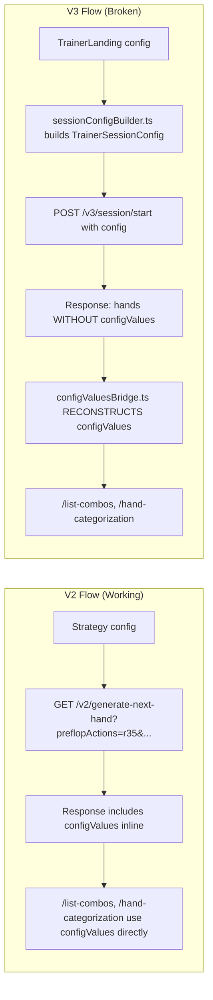
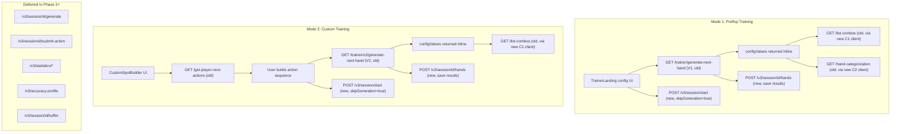

# Trainer V3 Revamp Plan

**Prepared:** Feb 20, 2026
**Branches:** Frontend `feature/trainerv3` | Backend `feature/trainerv3`
**Reference:** `TRAINER_V3_PHASE1_RELEASE_PLAN.md`

---

## 1. Architecture Comparison: V1 vs V2 vs V3

### 1.1 High-Level Flow Differences

```mermaid
flowchart TD
    subgraph V1_Preflop ["V1 — Mode 1 Target"]
        V1A["User selects spot + position"] --> V1B["GET /trainer/generate-next-hand"]
        V1B --> V1C["Backend: generate_generic_action_combinations"]
        V1C --> V1D["Return hand + actions + configValues"]
        V1D --> V1E["FE: Show action buttons, evaluate locally"]
    end
    subgraph V2_Custom ["V2 — Mode 2 Target"]
        V2A["User builds action sequence in Strategy"] --> V2B["Click Train button"]
        V2B --> V2C["GET /trainer/v2/generate-next-hand"]
        V2C --> V2D["Backend: StrategyRequestProcessor pipeline"]
        V2D --> V2E["Return hand + actions + configValues"]
        V2E --> V2F["FE: Show action buttons, evaluate locally"]
    end
    subgraph V3_Current ["V3 — Current (Vibe-coded)"]
        V3A["User configures in TrainerLanding"] --> V3B["POST /v3/session/start"]
        V3B --> V3C["Backend: generate_hands via Native OR Strategy Platform"]
        V3C --> V3D["Return sessionId + batch of hands"]
        V3D --> V3E["FE: configValuesBridge reconstructs strategy params"]
        V3E --> V3F["FE: Fetches strategy data via /list-combos etc."]
    end
```



### 1.2 API Endpoint Comparison

| Aspect | V1 | V2 | V3 |
|--------|----|----|-----|
| **Hand generation** | `GET /trainer/generate-next-hand` | `GET /trainer/v2/generate-next-hand` | `POST /v3/session/start` + `POST /v3/session/{id}/generate` |
| **Hand eval** | Frontend-only (local EV calc) | Frontend-only | Frontend (spot) OR `POST /v3/session/{id}/submit-action` (street/full_hand) |
| **Session persistence** | None (stateless) | None (stateless) | `POST /v3/session/{id}/hands`, `POST /v3/session/{id}/end` |
| **Strategy data** | Inline in hand response (`configValues`) | Inline in hand response (`configValues`) | Reconstructed via `configValuesBridge` from session + hand data |
| **Spot selection** | `spot=unopened` param | `preflopActions=r35,c` params | `preflopSpot` in session config, backend builds full action sequence |
| **Board cards** | Random (backend) | From strategy cardSelection | Backend samples or uses locked cards |
| **Buffering** | FE buffer of 15 hands | FE buffer of 15 hands | Batch generation (2 initial + refill via /generate) |

### 1.3 Backend Generation Pipeline

| Aspect | V1 | V2 | V3 |
|--------|----|----|-----|
| **Entry** | `trainer/views/spot_generation.py::GenerateNextHand` | `trainer/views/spot_generation.py::GenerateNextHandV2` | `trainer_v3/views/session_views.py::StartSessionView` |
| **Core** | `generate_generic_action_combinations()` | `StrategyRequestProcessor` pipeline | Native path (preflop) OR Strategy Platform path (postflop) |
| **Response** | Single hand with `configValues` inline | Single hand with `configValues` inline | Batch of hands (no `configValues` — FE reconstructs) |
| **Solver** | Same solver DB | Same solver DB | Same solver DB |

**Critical difference**: V1/V2 return `configValues` inline (site, BB, numPlayers, actions, boardCards, etc.), which the FE passes directly to `/list-combos` and `/hand-categorization`. V3 does NOT return this — the FE must reconstruct it via `configValuesBridge.ts`, which is a major source of bugs.

### 1.4 V1/V2 Code on Current Branch vs Staging

Both FE and BE are on `feature/trainerv3`. The V1/V2 code on this branch has been **modified from staging** but the core hand-generation logic is intact and improved:

| Category | Changes | Impact |
|----------|---------|--------|
| **Type safety** | Backend uses `StrategyCalculationData` typed objects instead of raw dicts | Non-breaking, better code |
| **Bug fixes** | Spins pot-size conversion, buffer race condition fix, range expansion, AttributeError fixes | Improvements over staging |
| **Navigation change** | `Train.tsx` now navigates to V3 trainer instead of V2 | Intentional — V3 is the target |
| **Solver/Strategy refactors** | New solver utilities (`strategies/utils/solver/`), mongo shared refactors, equity helpers | Strategy platform improvements |

**No code needs to be backported from staging.** The `feature/trainerv3` branch has everything V1/V2 had, plus improvements.

---

## 2. Strategy Endpoints Mapping to Trainer V3 Custom Mode

### 2.1 Strategy Endpoints Used for Navigation

| Endpoint | Purpose | Params | Used in V3? |
|----------|---------|--------|-------------|
| `GET /get-player-next-actions` | Navigate strategy tree (next available actions) | `variant, game, numPlayers, BB, stackInBB, site, blindStructure, openRaise, research, preflopActions, flopActions, turnActions, boardCards, betSizings` | **YES** — `CustomSpotBuilder.tsx` calls this exact endpoint |
| `GET /list-combos` | Combo-level strategy data (frequencies, EV) | Same as above | **YES** — `fetchStrategyCombos.ts` (hero range display) |
| `GET /hand-categorization` | Hand categorization | Same as above | **YES** — `fetchHandCategorization.ts` |
| `GET /strategy-result` | Top-ranked strategy data | Same as above | **NO** — not used in trainer |
| `GET /aggr-probs` | Aggregated action probabilities | Same as above | **NO** — not used in trainer |
| `GET /first-level-matrix` | Matrix data | Same as above | **NO** — not used in trainer |
| `GET /get-state-information` | State info (positions, stacks) | Same as above | **NO** — not used in trainer |

### 2.2 CustomSpotBuilder Already Uses Strategy APIs

`CustomSpotBuilder.tsx` (lines 184-191) calls `/get-player-next-actions` via:
```
dispatch(getPlayerActions(queryParams))
```

It uses the same Redux action (`getPlayerActions`) and the same `playerActionsReducer` slice as the Strategy page. Query params are built identically:
- `variant, game, numPlayers, BB, stackInBB, site, blindStructure, openRaise, research`
- Action sequences: `preflopActions, flopActions, turnActions` (comma-separated via `selectedActionQuery()`)
- Board cards: `boardCards` (comma-separated)

**The Custom Mode (Mode 2) frontend config flow is already Strategy-compatible.** The problem is not in the config UI — it is in the **hand generation pipeline** and the **config bridge** that follows.

### 2.3 The Config Bridge Gap (Root Cause of Unhappy Paths)



V3's `configValuesBridge.ts` is the main fragility point. It reconstructs `LastConfigValues` by:
1. Reading `TrainerSessionConfig` (session-level)
2. Reading `TrainerSessionHand` (per-hand: `heroPosition`, `boardCards`, `players`)
3. Reading `ConfigBridgeContext` (app-level: `variant`, `BB`, `openRaise`)
4. Deriving action sequences from spot names or hand player data

Failure modes:
- Missing `resolvedParams` from backend
- Action derivation from `hand.players[].lastAction` string matching (fragile)
- Mismatch between session-level and per-hand data
- Board cards format differences

---

## 3. Identified Unhappy Paths in V3

### 3.1 Frontend Unhappy Paths

| Issue | Where | Impact |
|-------|-------|--------|
| **Config bridge mismatch** | `configValuesBridge.ts` | Strategy queries fail (wrong params), hero range doesn't load |
| **Custom config not passed** | `sessionConfigBuilder.ts::buildCustomConfig()` — requires preflop actions in Redux | Custom mode hands generated for wrong spot |
| **playerActionsReducer state conflicts** | Shared with Strategy page — navigating Strategy then Trainer can leave stale state | Wrong actions in custom mode |
| **Spot discovery failures** | `useSpotDiscovery.ts` — calls `/spots/available` which may return empty | Crash or no spots to select |
| **Position validation gaps** | V3 allows 'Any' position but V1/V2 require specific positions for spot validation | Backend generates hands for invalid hero/spot combos |
| **simulationType auto-corrections** | `sessionConfigBuilder.ts` lines 241-266 | Silently changes DB type, user gets unexpected behavior |
| **Missing 3bet/4bet sizing** | V3 sends `3bet`/`4bet` only if present in Redux | Strategy key mismatch, no hands found |
| **Buffer refill failures** | `useBatchBuffer.ts` — silent failures on `/v3/session/{id}/generate` | Training stops silently after initial batch |
| **Multi-table state conflicts** | `MultiTableGrid` shares session but tables may desync | Duplicate hands, wrong evaluations |

### 3.2 Backend Unhappy Paths

| Issue | Where | Impact |
|-------|-------|--------|
| **Native generation limits** | `core.py::_generate_hands_native` — only preflop | All postflop falls to Strategy Platform path (slower, more failure modes) |
| **Action sequence building** | `config.py::_build_preflop_actions` — heuristic position mapping | Wrong actions for edge cases (e.g., squeeze with non-BB hero) |
| **Tree discovery failures** | `config.py::_discover_postflop_preflop_actions` — walks strategy tree | 3BP/4BP get wrong raise sizes (falls back to `r100` placeholder) |
| **Custom config action parsing** | Backend receives comma-separated strings from FE | Format mismatches between FE action keys and backend expectations |
| **BB decimal bug** | Backend `int("5.00")` crashes | Config with decimal BB values causes 500 |
| **Precision DB postflop** | Only works with 2-player postflop | >2 player precision postflop silently fails |
| **resolvedParams not returned** | Backend may not include `resolvedParams` in hand response | FE config bridge has no ground truth for strategy params |

### 3.3 Why Standard Postflop Modes Should Be Hidden (Custom Mode Subsumes Them)

Standard postflop modes (Flop/Turn/River from the StreetSelector dropdown) should be hidden in Phase 1 — not because they are technically broken, but because **Custom Mode already covers every postflop scenario with better correctness and UX**.

The core problem: when a user picks "Flop → SRP" from a dropdown, the backend must **guess** the exact preflop action sequence that leads to that pot type. This requires heuristic action building (`_build_postflop_preflop_actions`) or tree discovery (`_discover_postflop_preflop_actions`), both of which have known failure modes (wrong raise sizes, placeholder `r100` for 3-bet/4-bet). Custom Mode eliminates this guesswork entirely because the user builds the sequence from the real strategy tree.

| What the user wants | Standard Postflop (dropdown) | Custom Mode |
|--------------------|------------------------------|-------------|
| **Train SRP on Flop** | Pick Flop → SRP → hero position. Backend must guess the exact action sequence. | Build the exact sequence: CO opens → BB calls → select flop cards → train. User sees exactly what happened preflop. |
| **Train 3BP on Turn** | Pick Turn → 3BP → hero position. Backend must guess raise sizes from tree. | Build: CO opens → BB 3-bets (exact size shown from tree) → CO calls → flop cards → turn card → train. |
| **Train 4BP on River** | Pick River → 4BP. Backend must discover 3-bet AND 4-bet sizes. | Build the full sequence with real sizes from the strategy tree. |

Custom Mode advantages over standard postflop:
- **Correct raise sizes** — fetched from the real strategy tree via `/get-player-next-actions`, not heuristic guesses
- **User visibility** — the user sees exactly what happened preflop before training on the postflop street
- **No backend guesswork** — the full action sequence is built client-side from tree data
- **Broader coverage** — supports all 21 solver scenarios (squeeze, limp pots, raise-over-limp, etc.), not just SRP/3BP/4BP
- **Proven APIs** — uses `/get-player-next-actions` (same as Strategy page) + `/trainer/v2/generate-next-hand` (V2 pipeline)

**Phase 2+ recommendation**: If standard postflop modes are brought back, implement them as **shortcuts that auto-populate the CustomSpotBuilder** — e.g., clicking "Flop → SRP" would pre-fill the custom spot builder with the standard SRP action sequence (fetched from the tree), then let the user confirm and start training. This gives the convenience of a dropdown with the correctness of tree-based discovery.

---

## 4. New APIs vs Reusable APIs

### 4.1 APIs That Existed on Staging (Before)

| # | Endpoint | Method | Purpose |
|---|----------|--------|---------|
| 1 | `/trainer/generate-next-hand` | GET | V1 hand generation (spot-based preflop) |
| 2 | `/trainer/v2/generate-next-hand` | GET | V2 hand generation (action-sequence-based, postflop) |
| 3 | `/trainer/v3/generate-next-hand` | GET | V3 batch hand generation |
| 4 | `/trainer/v4/generate-next-hand` | GET | V4 state-based batch generation |
| 5 | `/trainer/trainer-games-config` | GET | Trainer config inventory |
| 6 | `/trainer/spins-trainer-config` | GET | Spins-specific config |
| 7 | `/trainer/validate-position-config` | GET | Validate hero/villain positions |
| 8 | `/trainer/update-played-count` | POST | Increment free-user daily play count |
| 9 | `/get-player-next-actions` | GET | Strategy tree navigation |
| 10 | `/list-combos` | GET | Combo-level strategy data |
| 11 | `/hand-categorization` | GET | Hand categorization data |

### 4.2 New APIs Introduced by Product Team (After)

#### Backend: `trainer_v3/` Django App (15,197 lines of new code)

| # | Endpoint | Method | Purpose |
|---|----------|--------|---------|
| N1 | `/trainer/v3/session/start` | POST | Create session + generate initial hand batch |
| N2 | `/trainer/v3/session/{id}/generate` | POST | Buffer refill (generate more hands) |
| N3 | `/trainer/v3/session/{id}/hands` | POST | Save hand results (batch) |
| N4 | `/trainer/v3/session/{id}/end` | POST | End session with summary |
| N5 | `/trainer/v3/session/{id}/submit-action` | POST | Multi-decision mode evaluation |
| N6 | `/trainer/v3/session/{id}` | GET | Session detail |
| N7 | `/trainer/v3/session/{id}/buffer` | GET | Unplayed buffer hands (resume) |
| N8 | `/trainer/v3/sessions` | GET | List sessions (paginated) |
| N9 | `/trainer/v3/hands` | GET | Flat list of hands across sessions |
| N10 | `/trainer/v3/statistics` | GET | Aggregate training statistics |
| N11 | `/trainer/v3/statistics/drill-down` | GET | Drill-down analysis |
| N12 | `/trainer/v3/statistics/compare` | GET | Compare statistics |
| N13 | `/trainer/v3/statistics/patterns` | GET | Pattern analysis |
| N14 | `/trainer/v3/preferences` | GET/PUT | User training preferences |
| N15 | `/trainer/v3/accuracy-profile` | GET | Adaptive difficulty profile |

#### Frontend: New API Clients (no backend counterpart on staging)

| # | FE File | Calls | Purpose |
|---|---------|-------|---------|
| C1 | `fetchStrategyCombos.ts` | `/list-combos` | Combo data for hero range (new client for old endpoint) |
| C2 | `fetchHandCategorization.ts` | `/hand-categorization` | Hand categories (new client for old endpoint) |
| C3 | `fetchVillainRange.ts` | `/list-combos` (modified params) | Villain range (old endpoint, reversed perspective) |
| C4 | `fetchTrainerStrategyResult.ts` | `/strategy-result` | Strategy result (new client for old endpoint) |
| C5 | `useSpotDiscovery.ts` | `/spots/available` | Discover available spots for config |

### 4.3 Verdict: What to KEEP, REUSE, and DROP

#### KEEP (New APIs that add real value for Phase 1)

| API | Why Keep |
|-----|----------|
| **N1** `/v3/session/start` | Session persistence is a core V3 requirement. Modify to support `skipGeneration=true`. |
| **N3** `/v3/session/{id}/hands` | Saving hand results is essential for session history. |
| **N4** `/v3/session/{id}/end` | Clean session lifecycle. |
| **N8** `/v3/sessions` | Session list for history tab. |
| **N14** `/v3/preferences` | User preferences persistence. |
| **C1-C3** FE strategy clients | Well-written clients for existing Strategy endpoints. Better than V1's approach. |

#### REUSE (Old APIs for hand generation — proven pipelines)

| API | Why Reuse | Replaces |
|-----|-----------|----------|
| **#1** `/trainer/generate-next-hand` (V1) | Proven preflop pipeline. Returns `configValues` inline. No config bridge needed. | N1's hand generation for Mode 1 (Preflop) |
| **#2** `/trainer/v2/generate-next-hand` (V2) | Proven action-sequence pipeline. Returns `configValues` inline. Handles postflop. | N1's hand generation for Mode 2 (Custom) |
| **#9** `/get-player-next-actions` | Strategy tree navigation. CustomSpotBuilder already uses it correctly. | Already used |
| **#10** `/list-combos` | Combo data. Already used via C1 client. | Already used |
| **#11** `/hand-categorization` | Hand categories. Already used via C2 client. | Already used |
| **#5** `/trainer/trainer-games-config` | Config inventory. Still needed for available options. | Already used |

#### DROP / DEFER (Not needed for Phase 1)

| API | Why Drop/Defer |
|-----|---------------|
| **N2** `/v3/session/{id}/generate` | Not needed if hand generation uses V1/V2 endpoints. Buffer refill = just call V1/V2 again. |
| **N5** `/v3/session/{id}/submit-action` | Multi-decision mode. Phase 1 is preflop + custom spot mode only. |
| **N6** `/v3/session/{id}` (detail) | Nice-to-have for history, but session list (N8) + save (N3) cover Phase 1. |
| **N7** `/v3/session/{id}/buffer` | Resume support. Not Phase 1. |
| **N9** `/v3/hands` (flat list) | History deep feature. |
| **N10-N13** `/v3/statistics/*` | Statistics drill-down. Explicitly out of Phase 1 scope. |
| **N15** `/v3/accuracy-profile` | Adaptive difficulty. Explicitly out of scope. |
| **N16-N19** Original training-sessions | Superseded by `trainer_v3` app endpoints. Redundant. |
| **C4** `fetchTrainerStrategyResult.ts` | Not used in the training loop. |
| **C5** `useSpotDiscovery.ts` (`/spots/available`) | No backend implementation found. Use V1's `trainer-games-config` instead. |
| **#3** `/trainer/v3/generate-next-hand` | Batch V1. Optional optimization, not needed. |
| **#4** `/trainer/v4/generate-next-hand` | V4 state-based. More complex, not needed. |

### 4.4 Phase 1 API Flow



---

## 5. Recommended Revamp Approach

### 5.1 Mode 1 (Preflop) — Reuse V1 Pipeline

V1's `GET /trainer/generate-next-hand` is battle-tested and returns `configValues` inline.

1. **FE**: Keep the TrainerLanding config UI (player count, spot, hero position, advanced settings)
2. **FE**: Build hand generation params like V1 does (`buildTrainerV1PayloadFromState` in `components/Trainer/utils.ts` lines 1849-1940)
3. **API**: Call `GET /trainer/generate-next-hand` (V1 endpoint) for hand generation
4. **FE**: Use the returned `configValues` directly for `/list-combos` and `/hand-categorization` (no config bridge needed)
5. **Session**: Wrap with V3 session persistence (create session on start, save results on hand completion)

### 5.2 Mode 2 (Custom) — Reuse V2 Pipeline + Strategy APIs

The CustomSpotBuilder already uses `/get-player-next-actions` (same as Strategy page).

1. **FE**: Keep CustomSpotBuilder (it already works with the Strategy tree)
2. **FE**: When user clicks "Start Training", build V2-style params from `playerActionsReducer.selectedActions` + `cardSelection`
3. **API**: Call `GET /trainer/v2/generate-next-hand` with the action sequences and board cards
4. **FE**: Use the returned `configValues` directly (no config bridge needed)
5. **Strategy data**: Call `/list-combos` and `/hand-categorization` with the same params

### 5.3 Session Persistence (Both Modes) — Track B

Keep V3 session persistence as a thin wrapper:
1. `POST /v3/session/start` with `skipGeneration=true` — creates session row only
2. Hand generation via V1/V2 endpoints (proven pipelines)
3. `POST /v3/session/{id}/hands` — save results after each hand
4. `POST /v3/session/{id}/end` — end session

### 5.4 Strategy Endpoint Reuse Summary

| Strategy Endpoint | Mode 1 (Preflop)? | Mode 2 (Custom)? | How |
|-------------------|-------------------|-------------------|-----|
| `/get-player-next-actions` | No | **YES** — CustomSpotBuilder | Already working |
| `/list-combos` | **YES** — hero range | **YES** — hero range | Params from inline `configValues` |
| `/hand-categorization` | **YES** | **YES** | Params from inline `configValues` |
| `/trainer/generate-next-hand` (V1) | **YES** — hand gen | No | Proven preflop pipeline |
| `/trainer/v2/generate-next-hand` (V2) | No | **YES** — hand gen | Proven postflop pipeline |

---

## 6. Key Files to Touch

### Frontend

| File | Change |
|------|--------|
| `components/UnifiedTrainer/hooks/useTrainingSession.ts` | Switch hand generation to V1 (preflop) or V2 (custom) endpoints |
| `components/UnifiedTrainer/utils/configValuesBridge.ts` | Simplify: use inline `configValues` from V1/V2 response instead of reconstruction |
| `components/UnifiedTrainer/utils/sessionConfigBuilder.ts` | Simplify: only needed for session creation (not hand generation) |
| `components/UnifiedTrainer/api/trainerSessionsApi.ts` | Add V1/V2 hand fetch functions; keep session persistence functions |
| `components/UnifiedTrainer/TrainerLanding.tsx` | Hide postflop modes, keep preflop + custom only |
| `components/UnifiedTrainer/Configuration/CustomSpot/CustomSpotBuilder.tsx` | Keep as-is (already uses Strategy APIs correctly) |

### Backend

| File | Change |
|------|--------|
| `trainer_v3/views/session_views.py` | Add `skipGeneration` flag to StartSessionView |
| `trainer/views/spot_generation.py` | No changes (V1/V2 endpoints stay as-is) |
| `trainer_v3/services/hand_generation/core.py` | Deprioritize — not used in Phase 1 |

---

## 7. Risk Assessment

| Risk | Mitigation |
|------|------------|
| V1/V2 endpoints don't support all V3 config options (board filters, adaptive difficulty) | Phase 1 explicitly defers these features. Add in Phase 2+ once core loop is stable. |
| `playerActionsReducer` state conflicts between Strategy page and CustomSpotBuilder | CustomSpotBuilder already resets state on mount (line 171-181). Verify no stale state leaks. |
| V1 endpoint doesn't return `resolvedParams` | Not needed — V1 returns `configValues` directly, which IS the resolved params. |
| Session persistence adds latency | Session creation is async (fire-and-forget on start); hand saves are batched. Minimal impact. |
| `/spots/available` (Spot Discovery) has no backend implementation | Use V1's `/trainer/trainer-games-config` for available options instead. |

---

## 8. Task Breakdown

| # | Task | Priority | Effort |
|---|------|----------|--------|
| 1 | Hide postflop modes from TrainerLanding (keep Preflop + Custom) | P0 | 2h |
| 2 | Wire Mode 1 to call V1 endpoint (`/trainer/generate-next-hand`) | P0 | 4h |
| 3 | Wire Mode 2 to call V2 endpoint (`/trainer/v2/generate-next-hand`) | P0 | 4h |
| 4 | Simplify configValuesBridge to use inline `configValues` from V1/V2 | P0 | 3h |
| 5 | Backend: Add `skipGeneration` flag to `StartSessionView` | P0 | 2h |
| 6 | Implement Track B session persistence (start → save hands → end) | P0 | 4h |
| 7 | Verify CustomSpotBuilder action sequence → V2 param mapping | P0 | 3h |
| 8 | End-to-end testing: both modes | P0 | 4h |
| 9 | Hide villain range panel | P1 | 1h |
| 10 | Fix ErrorBoundary reset flow | P1 | 1h |

**Total estimated effort: ~28 hours**

---

## 9. Phase 2+ Roadmap

1. **Phase 2:** Enable standard postflop modes (Flop/Turn/River) via V3's `submit-action` pipeline
2. **Phase 3:** Implement villain range display
3. **Phase 4:** Add Street/Full Hand game modes
4. **Phase 5:** Statistics drill-down and history features
5. **Phase 6:** Adaptive difficulty via accuracy-profile
