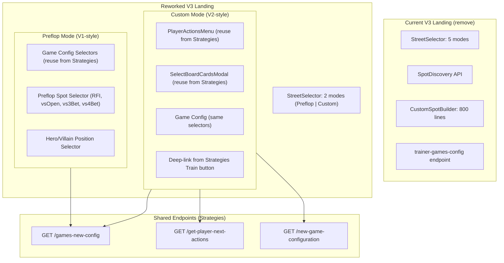

# Trainer V3 Landing Page Rework Plan

## Why This Revamp Is Required

### 1. The current V3 landing is unstable and full of unhappy paths

The V3 landing page (`components/UnifiedTrainer/TrainerLanding.tsx`, 1,146 lines) was vibe-coded by a non-engineer. It exposes 5 street modes (Preflop/Flop/Turn/River/Custom), each with independent spot/config logic, an 800-line custom action builder, spot discovery edge cases, and multiple auto-correction loops that fight each other. The surface area is too large to stabilize — every combination of street × spot × config is a potential failure path.

### 2. Custom Mode replaces standard postflop dropdowns — this is a UX and correctness improvement, not a feature cut

When a user selects "Flop → SRP" from a dropdown, the backend must **guess** the exact preflop action sequence that led to that pot type. This guesswork has known failure modes, particularly for 3-bet and 4-bet pots where raise sizes vary across solver configurations:

| User Goal | Dropdown Approach | Custom Mode Approach |
|-----------|-------------------|----------------------|
| Train SRP on Flop | Select Flop → SRP → position. Backend guesses the preflop sequence. | Build exact sequence: CO opens → BB calls → select flop. User sees what happened preflop. |
| Train 3BP on Turn | Select Turn → 3BP → position. Backend guesses raise sizes. | Build sequence with real sizes from the strategy tree. No guessing. |
| Train 4BP on River | Select River → 4BP. Backend must discover both 3-bet and 4-bet sizes. | Full sequence built from the actual strategy tree data. |

Custom Mode uses the same strategy tree API (`/get-player-next-actions`) that powers the Strategy page — the most thoroughly tested endpoint in the platform. Every action and raise size shown to the user comes directly from the solver's computed strategy, not from heuristic approximation.

### 3. V1 and V2 are proven flows that already work

Trainer V1 (preflop config + spot selection) and Trainer V2 (strategy-driven custom training) have been in production on `staging`. Combining them gives us a landing page built on working foundations rather than speculative UI.

### 4. Endpoint reuse reduces integration surface

By reusing the strategies page's endpoints (`/games-new-config`, `/get-player-next-actions`) and components (`PlayerActionsMenu`, `SelectBoardCardsModal`), we eliminate an entire class of bugs: config mismatches between what the trainer shows and what strategies actually support.

---

## Strategy: V1 + V2 Hybrid

Strip the landing to two modes that are proven to work:

- **Preflop mode** = V1's config-driven flow (user picks game settings + preflop spot + positions)
- **Custom mode** = V2's strategies-driven flow (user navigates actions like the Strategies page, with board card selection)

Reuse strategies page endpoints and components instead of trainer-specific ones.

---

## Architecture Change

---

## Detailed Changes

### 1. Simplify StreetSelector

**File:** `components/UnifiedTrainer/Configuration/StreetSelector.tsx`

Remove Flop, Turn, River options. Keep only:

- `preflop` — Preflop training (V1 flow)
- `custom` — Custom scenario (V2/Strategies flow)

This eliminates the entire postflop-standalone unhappy path (no postflop pot type selector, no standalone flop/turn/river spot discovery).

### 2. Preflop Mode Config (V1-style)

**Goal:** When user selects "Preflop", show a clean config form like Trainer V1.

**Reuse from Strategies page:**

- Game config dropdowns: Casino/Site, BB, Blind Structure, Players, Stack, Open Raise
- Endpoint: `GET /games-new-config` (currently in `store/asyncActions.ts` as `getGamesConfig`) replaces `GET /trainer/trainer-games-config`
- Config cascade logic: already exists in `hooks/useGameConfig.ts`

**Keep from V3:**

- `SpotSelector.tsx` preflop spots only (RFI, Facing Open, Facing 3-Bet, Facing 4-Bet, Squeeze)
- Hero position selection on the poker table preview
- Difficulty selector from AdvancedSettingsModal
- Preferences persistence (`useTrainerPreferences`)

**Remove:**

- Postflop spots (srp, 3bp, 4bp) from SpotSelector
- SpotDiscovery hook for preflop (unnecessary — config cascade already validates)
- The `disabledStreets` logic and auto-correction loops for postflop

### 3. Custom Mode Config (V2 + Strategies UX)

**Goal:** When user selects "Custom", embed the strategies action navigation inline.

**Replace the `CustomSpotBuilder`** (800+ lines in `CustomSpot/CustomSpotBuilder.tsx`) with the actual strategies components:

- **`PlayerActionsMenu`** (`components/PlayerActions/PlayerActionsMenu.tsx`): Reuse the strategies action tree navigation. This component already works, is battle-tested, and uses `GET /get-player-next-actions`.
- **`SelectBoardCardsModal`** (`components/Modals/SelectBoardCardsModal.tsx`): Reuse the exact same board card popup from strategies. It already manages card state via `playerActionsReducer.cardSelection`.

**Two entry paths for Custom mode:**

1. **Self-contained on trainer landing:** User selects game config, then navigates actions inline using the embedded `PlayerActionsMenu`. Same flow as the Strategies left panel.
2. **Deep link from Strategies page:** The existing `Train.tsx` button already builds a deep link via `buildTrainerDeepLink`. Enhance it to also pass the full action sequence + board cards so Custom mode can pre-populate.

### 4. Switch Config Endpoint

**Current:** V3 landing fetches `GET /trainer/trainer-games-config` via `getTrainerGamesConfig` thunk.

**New:** Switch to `GET /games-new-config` via `getGamesConfig` thunk (same as Strategies).

Both return the same nested config tree structure. The strategies endpoint is more maintained and already handles all edge cases. This means `useTrainerGameConfig` can be simplified to delegate to the existing strategies config cascade in `hooks/useGameConfig.ts`.

### 5. Backend Recommendation: Keep V3

Keep the V3 backend (`POST /trainer/v3/session/start` and session lifecycle). Reasons:

- Batch hand generation (2 hands initial, 25 buffer) gives faster first-hand delivery
- Proper session lifecycle (auto-end stale sessions, stats persistence)
- Multi-decision support (street mode, full hand mode) already built
- Statistics endpoints (aggregate, drill-down, patterns) are V3-only
- V1/V2 endpoints are legacy and would be deprecated anyway

The landing page changes are **frontend-only**. The V3 `session/start` payload already accepts `customConfig` with `preflopActions`, `flopActions`, `boardCards`, etc., which is exactly what the Custom mode provides.

---

## Files to Remove or Gut

| File | Action |
|------|--------|
| `Configuration/CustomSpot/CustomSpotBuilder.tsx` (800+ lines) | **Remove** — replaced by embedded `PlayerActionsMenu` |
| `Configuration/CustomSpot/generateStreetActions.ts` | **Remove** — backend provides actions via `get-player-next-actions` |
| `hooks/useSpotDiscovery.ts` | **Remove** — no longer needed with simplified modes |
| `utils/spotDiscoveryMapping.ts` | **Remove** |
| `Configuration/SpotSelector.tsx` postflop section | **Gut** — remove postflop pot type logic, keep preflop spots |
| `Configuration/StreetSelector.tsx` | **Simplify** — 2 modes instead of 5 |
| `hooks/useTrainerGameConfig.ts` (461 lines) | **Simplify** — delegate to strategies `useGameConfig` |
| `TrainerLanding.tsx` auto-correction effects (lines 466-546) | **Remove** — no longer needed without postflop standalone modes |

---

## Component Reuse Map

| Need | Reuse From | Current Location |
|------|-----------|-----------------|
| Game config dropdowns | Strategies GameConfiguration | `components/GameConfiguration/` |
| Config cascade validation | Strategies `useGameConfig` | `hooks/useGameConfig.ts` |
| Action tree navigation | Strategies PlayerActionsMenu | `components/PlayerActions/PlayerActionsMenu.tsx` |
| Board card selector | Strategies SelectBoardCardsModal | `components/Modals/SelectBoardCardsModal.tsx` |
| Config endpoint | Strategies games-new-config | `store/asyncActions.ts` (`getGamesConfig`) |
| Action endpoint | Strategies get-player-next-actions | `store/asyncActions.ts` (`getPlayerActions`) |

---

## Deep Link Enhancement

The Strategies "Train" button (`components/StrategyElements/Train.tsx`) currently builds a deep link with preflop spot and game config. For custom mode support, enhance `buildTrainerDeepLink` to also carry:

- Full action sequence (`selectedActions` from `playerActionsReducer`)
- Board cards (`cardSelection`)
- Active street
- Research type / simulation type

When the trainer landing receives these URL params, it pre-populates the Custom mode with the full action sequence and board cards — no re-navigation needed.

---

## What Stays Unchanged

- `PokerTable2D` preview on the landing page
- `ConfigSummaryBar` (Database | Stake | Site | Stack)
- Preferences persistence (`useTrainerPreferences`)
- URL sync (`useTrainerUrlSync`) — simplified for 2 modes
- Difficulty selector
- The entire V3 gameplay loop (post-"Start Training")
- All V3 backend endpoints

---

## Risk Assessment

- **Low risk:** StreetSelector simplification, SpotSelector preflop-only — straightforward removals
- **Medium risk:** Embedding `PlayerActionsMenu` in trainer landing — this component currently reads from `playerActionsReducer` which is shared with the Strategies page. Need to ensure no state conflicts when the user navigates between Strategies and Trainer.
- **Medium risk:** Switching from `trainer-games-config` to `games-new-config` — response shapes are similar but need to verify field compatibility
- **Low risk:** Deep link enhancement — additive change to existing working mechanism

---

## Implementation Todos

1. Simplify StreetSelector to 2 modes (Preflop | Custom), remove Flop/Turn/River
2. Implement Preflop mode: reuse strategies game config selectors + keep preflop SpotSelector + position picker
3. Switch from `trainer-games-config` to `games-new-config` endpoint, simplify `useTrainerGameConfig` to delegate to `useGameConfig`
4. Replace CustomSpotBuilder with embedded `PlayerActionsMenu` + `SelectBoardCardsModal` from Strategies
5. Enhance `buildTrainerDeepLink` to carry full action sequence + board cards for Custom mode pre-population
6. Remove dead code: CustomSpotBuilder, generateStreetActions, useSpotDiscovery, spotDiscoveryMapping, postflop SpotSelector logic, auto-correction loops
7. Ensure `playerActionsReducer` state isolation between Strategies page and Trainer Custom mode (no cross-contamination)
8. Simplify TrainerLanding.tsx: remove postflop auto-correction effects, streamline conditional rendering for 2 modes
9. Add/update unit tests for reworked landing page, StreetSelector, Custom mode embedded navigation
