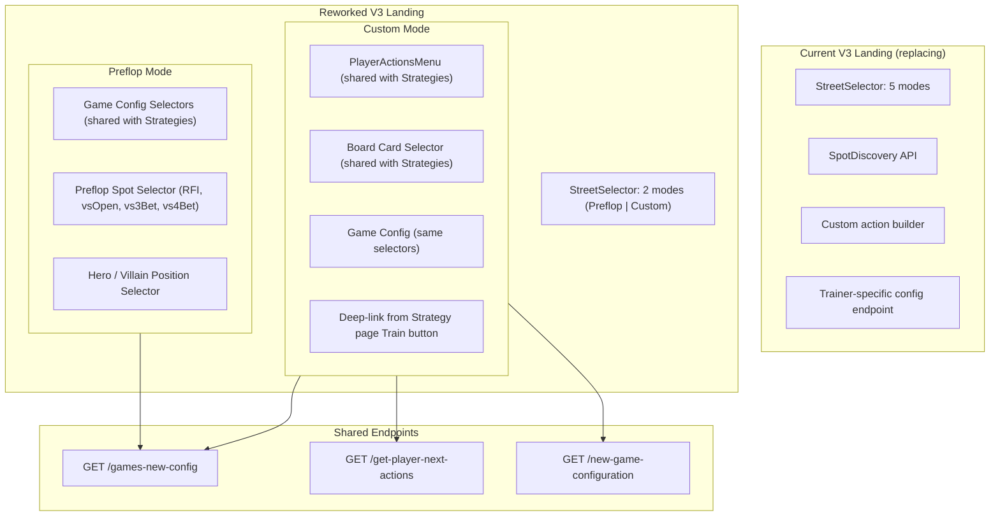

# Trainer V3 Landing Page

### 1. The current V3 landing has too many configuration paths to stabilize

The V3 landing page exposes 5 street modes (Preflop / Flop / Turn / River / Custom), each with its own spot selection logic, config validation, and edge cases. This creates a large combinatorial surface — every combination of street × spot × game config is a potential failure path. The result is a fragile experience with numerous unhappy paths that are difficult to test and maintain.

### 2. Custom Mode is a better experience than postflop dropdowns — not a feature cut

When a user selects "Flop → SRP" from a dropdown, the backend must **infer** the exact preflop action sequence that led to that pot type. This inference has known failure modes, particularly for 3-bet and 4-bet pots where raise sizes vary across solver configurations:

| User Goal | Dropdown Approach | Custom Mode Approach |
|-----------|-------------------|----------------------|
| Train SRP on Flop | Select Flop → SRP → position. Backend infers the preflop sequence. | Build exact sequence: CO opens → BB calls → select flop cards. User sees what happened preflop. |
| Train 3BP on Turn | Select Turn → 3BP → position. Backend infers raise sizes. | Build sequence with real sizes from the strategy tree. No inference needed. |
| Train 4BP on River | Select River → 4BP. Backend must discover both 3-bet and 4-bet sizes. | Full sequence built from actual strategy tree data. |

Custom Mode uses the same strategy tree API (`/get-player-next-actions`) that powers the Strategy page — the most thoroughly tested endpoint in the platform. Every action and raise size presented to the user comes directly from the solver's computed strategy, not from heuristic approximation.

**Users who want to train postflop spots can still do so — with higher accuracy and full visibility into the action sequence that created the pot.**

### 3. Preflop (V1) and Custom (V2) are proven flows

Trainer V1 (preflop config + spot selection) and Trainer V2 (strategy-driven custom scenarios) have been running in production. Combining them into the V3 landing gives us a page built on proven foundations with well-understood behavior.

### 4. Shared endpoints reduce integration risk

By reusing the Strategy page's endpoints (`/games-new-config`, `/get-player-next-actions`) and UI components (`PlayerActionsMenu`, `SelectBoardCardsModal`), we eliminate a class of bugs where the trainer and the strategy browser show different configuration options or produce different results for the same setup.

---

## Approach: V1 + V2 Hybrid

Simplify the landing page to two training modes:

- **Preflop** — V1-style config-driven flow. User selects game settings, preflop spot (RFI, Facing Open, Facing 3-Bet, etc.), and hero/villain positions.
- **Custom** — V2-style strategy-driven flow. User navigates the action tree (same UX as the Strategy page), selects board cards, and trains on any street at any spot — with full control over the exact scenario.

---

## Architecture Overview

---

## Detailed Changes

### 1. Simplify the Street Selector

Remove Flop, Turn, and River as standalone training modes. Keep only:

- **Preflop** — Preflop-only training
- **Custom** — Build any scenario (including postflop) from the strategy tree

This eliminates the standalone postflop configuration paths and all associated edge cases (pot type inference, spot discovery for individual streets, auto-correction loops).

### 2. Preflop Mode (V1-style)

When the user selects "Preflop", show a clean configuration form:

- **Game config dropdowns** (Site, BB, Blind Structure, Players, Stack, Open Raise) — reused from the Strategy page
- **Preflop spot selector** (RFI, Facing Open, Facing 3-Bet, Facing 4-Bet, Squeeze)
- **Hero position** selection on the poker table preview
- **Difficulty** selector
- **Config endpoint**: `GET /games-new-config` (same as Strategy page), replacing the trainer-specific `GET /trainer/trainer-games-config`

### 3. Custom Mode (V2 + Strategy Page UX)

When the user selects "Custom", embed the Strategy page's action navigation directly in the trainer landing:

- **Action tree navigation** (`PlayerActionsMenu`) — the same component used on the Strategy page. Users click through the action sequence just as they would when browsing strategies.
- **Board card selector** (`SelectBoardCardsModal`) — same popup used on the Strategy page for selecting flop/turn/river cards.
- **Game config dropdowns** — same shared selectors as Preflop mode.

**Two ways to enter Custom mode:**

1. **On the trainer landing page** — User configures game settings, builds the action sequence, selects board cards, and starts training. Self-contained experience.
2. **From the Strategy page** — User clicks "Train" on the Strategy page. The current config (actions, board cards, game settings) transfers to the trainer via a deep link. No re-configuration needed.

### 4. Backend: No Changes Required

The V3 backend (`POST /trainer/v3/session/start`) remains unchanged. It already accepts a `customConfig` payload with `preflopActions`, `flopActions`, `boardCards`, etc. — which is exactly what Custom Mode produces.

This rework is **frontend-only**.

---

## What Users Gain

| Before (Current V3) | After (Reworked V3) |
|---------------------|---------------------|
| 5 street modes with different config flows | 2 clear modes: Preflop and Custom |
| Postflop training requires backend to infer action sequences | Users build exact sequences from real solver data |
| Custom spot builder with separate implementation from Strategy page | Same action navigation UX as the Strategy page |
| Board card selection built from scratch | Same board card popup as the Strategy page |
| Trainer-specific config endpoint with its own edge cases | Shared config endpoint, same data as Strategy page |

---

## What Stays Unchanged

- Poker table preview on the landing page
- Config summary bar (Database | Stake | Site | Stack)
- User preferences persistence
- Shareable URL support
- Difficulty selector
- The entire gameplay loop (everything after "Start Training")
- All backend endpoints

---

## Component Reuse Summary

| Capability | Reused From | Source |
|-----------|------------|--------|
| Game config dropdowns | Strategy page | `components/GameConfiguration/` |
| Config cascade validation | Strategy page | `hooks/useGameConfig.ts` |
| Action tree navigation | Strategy page | `components/PlayerActions/PlayerActionsMenu.tsx` |
| Board card selector | Strategy page | `components/Modals/SelectBoardCardsModal.tsx` |
| Config data endpoint | Strategy page | `GET /games-new-config` |
| Action tree endpoint | Strategy page | `GET /get-player-next-actions` |

---

## Deep Link: Strategy Page → Trainer

The Strategy page's "Train" button currently passes preflop spot and game config to the trainer via URL parameters. This will be enhanced to also carry:

- Full action sequence (all streets)
- Board cards
- Active street
- Research / simulation type

This allows users to seamlessly move from browsing a strategy to training on that exact spot — Custom mode pre-populates with the full configuration.

---

## Risk Assessment

| Area | Risk | Mitigation |
|------|------|-----------|
| Street selector simplification | Low | Straightforward removal of unused options |
| Preflop spot selector (preflop-only) | Low | Removing postflop options, no new logic |
| Embedding Strategy page action navigation in trainer | Medium | Component reads from shared Redux state — need to ensure no cross-contamination between Strategy page and Trainer |
| Switching config endpoint | Medium | Response shapes are similar but need field compatibility verification |
| Deep link enhancement | Low | Additive change to existing working mechanism |

---

## Implementation Steps

1. Simplify StreetSelector to 2 modes (Preflop | Custom), remove Flop/Turn/River
2. Wire Preflop mode with Strategy page config selectors and preflop spot picker
3. Switch from `trainer-games-config` to `games-new-config` endpoint
4. Replace custom action builder with embedded `PlayerActionsMenu` and `SelectBoardCardsModal`
5. Enhance deep link to carry full action sequence and board cards for Custom mode
6. Remove dead code (custom builder, spot discovery, postflop auto-correction logic)
7. Ensure Redux state isolation between Strategy page and Trainer Custom mode
8. Simplify `TrainerLanding.tsx` conditional rendering for 2 modes
9. Update unit tests for reworked landing page
