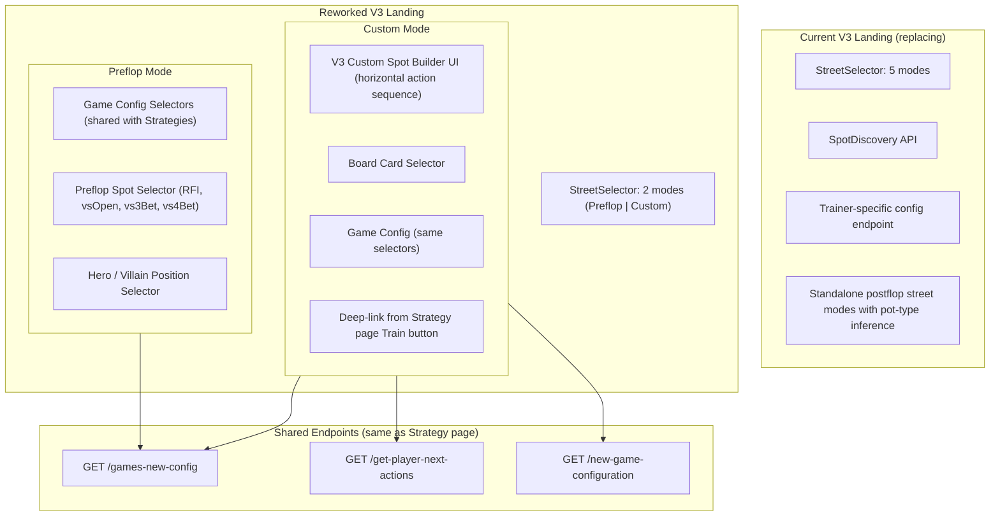

# Trainer V3 Landing Page

### 1. The current V3 landing has too many configuration paths to stabilize

The V3 landing page exposes 5 street modes (Preflop / Flop / Turn / River / Custom), each with its own spot selection logic, config validation, and edge cases. This creates a large combinatorial surface — every combination of street × spot × game config is a potential failure path. The result is a fragile experience with numerous unhappy paths that are difficult to test and maintain.

### 2. Custom Mode is a better experience than postflop dropdowns — not a feature cut

When a user selects "Flop → SRP" from a dropdown, the backend must **infer** the exact preflop action sequence that led to that pot type. This inference has known failure modes, particularly for 3-bet and 4-bet pots where raise sizes vary across solver configurations:

| User Goal | Dropdown Approach | Custom Mode Approach |
|-----------|-------------------|----------------------|
| Train SRP on Flop | Select Flop → SRP → position. Backend infers the preflop sequence. | Build exact sequence: CO opens → BB calls → select flop cards. User sees what happened preflop. |
| Train 3BP on Turn | Select Turn → 3BP → position. Backend infers raise sizes. | Build sequence with real sizes from the strategy tree. No inference needed. |
| Train 4BP on River | Select River → 4BP. Backend must discover both 3-bet and 4-bet sizes. | Full sequence built from actual strategy tree data. |

Custom Mode uses the same strategy tree API (`/get-player-next-actions`) that powers the Strategy page — the most thoroughly tested endpoint in the platform. Every action and raise size presented to the user comes directly from the solver's computed strategy, not from heuristic approximation.

**Users who want to train postflop spots can still do so — with higher accuracy and full visibility into the action sequence that created the pot.**

### 3. Preflop (V1) and Custom (V2) are proven flows

Trainer V1 (preflop config + spot selection) and Trainer V2 (strategy-driven custom scenarios) have been running in production. Combining them into the V3 landing gives us a page built on proven foundations with well-understood behavior.

### 4. Shared endpoints reduce integration risk

By reusing the Strategy page's endpoints (`/games-new-config`, `/get-player-next-actions`) and config cascade logic, we eliminate a class of bugs where the trainer and the strategy browser show different configuration options or produce different results for the same setup.

---

## Approach: V1 + V2 Hybrid

Simplify the landing page to two training modes:

- **Preflop** — V1-style config-driven flow. User selects game settings, preflop spot (RFI, Facing Open, Facing 3-Bet, etc.), and hero/villain positions.
- **Custom** — V2-style strategy-driven flow. User builds the exact action sequence, selects board cards, and trains on any street at any spot — with full control over the scenario.

---

## Architecture Overview

---

## Detailed Changes

### 1. Simplify the Street Selector

Remove Flop, Turn, and River as standalone training modes. Keep only:

- **Preflop** — Preflop-only training
- **Custom** — Build any scenario (including postflop) from the strategy tree

This eliminates the standalone postflop configuration paths and all associated edge cases (pot type inference, spot discovery for individual streets, auto-correction loops).

### 2. Preflop Mode (V1-style)

When the user selects "Preflop", show a clean configuration form:

- **Game config dropdowns** (Site, BB, Blind Structure, Players, Stack, Open Raise) — reused from the Strategy page
- **Preflop spot selector** (RFI, Facing Open, Facing 3-Bet, Facing 4-Bet, Squeeze)
- **Hero position** selection on the poker table preview
- **Difficulty** selector
- **Config endpoint**: `GET /games-new-config` (same as Strategy page), replacing the trainer-specific `GET /trainer/trainer-games-config`

### 3. Custom Mode (V3 UI + Strategy Page APIs)

When the user selects "Custom", the V3 Custom Spot Builder UI is shown — the horizontal, GTO Wizard-style action sequence with position cards, board card selectors, and progressive disclosure of actions per street.

**What stays (V3 UI/UX):**

- The horizontal action sequence layout (PositionCard + BoardCard components)
- Progressive disclosure: preflop actions appear first, postflop streets reveal as the sequence progresses
- Board card selection inline with the action sequence
- Hand-over detection and winner display
- Database-aware constraints (preflop-only, full tree, precision)
- Reset button and loading/error states

**What is stabilized (API alignment with Strategy page):**

The Custom Spot Builder already calls `/get-player-next-actions` — the same endpoint the Strategy page uses. The stabilization work ensures this integration is robust:

- **Config endpoint**: Switch from `GET /trainer/trainer-games-config` to `GET /games-new-config` (same as Strategy page) so the game config dropdowns draw from the same data source
- **Board card modal**: Reuse the Strategy page's `SelectBoardCardsModal` so board card selection behavior is identical
- **Config cascade**: Align with the Strategy page's `useGameConfig` cascade logic to ensure available options (sites, BBs, stacks, etc.) are consistent
- **Query parameter construction**: Ensure the `CustomSpotBuilder` constructs its `/get-player-next-actions` queries identically to the Strategy page — same parameter names, same defaults, same research type mapping
- **Fix known edge cases**: Resolve the unhappy paths in the current Custom Spot Builder (auto-correction loops, state synchronization issues between advanced settings and the action builder)

**Two ways to enter Custom mode:**

1. **On the trainer landing page** — User configures game settings, builds the action sequence using the horizontal builder, selects board cards, and starts training. Self-contained experience.
2. **From the Strategy page** — User clicks "Train" on the Strategy page. The current config (actions, board cards, game settings) transfers to the trainer via a deep link, pre-populating the Custom Spot Builder. No re-configuration needed.

### 4. Backend: No Changes Required

The V3 backend (`POST /trainer/v3/session/start`) remains unchanged. It already accepts a `customConfig` payload with `preflopActions`, `flopActions`, `boardCards`, etc. — which is exactly what Custom Mode produces.

This rework is **frontend-only**.

---

## What Users Gain

| Before (Current V3) | After (Reworked V3) |
|---------------------|---------------------|
| 5 street modes with different config flows | 2 clear modes: Preflop and Custom |
| Postflop training requires backend to infer action sequences | Users build exact sequences from real solver data |
| Trainer-specific config endpoint with its own edge cases | Shared config endpoint, same data as Strategy page |
| Board card selection with separate implementation | Board card popup consistent with the Strategy page |
| Config cascade with trainer-specific validation logic | Config cascade aligned with Strategy page — one source of truth |
| Custom builder calls same API but with inconsistent query construction | Query construction aligned with Strategy page for consistent results |

---

## What Stays Unchanged

- Poker table preview on the landing page
- Config summary bar (Database | Stake | Site | Stack)
- Custom Spot Builder visual design (horizontal action sequence, position cards, board cards)
- User preferences persistence
- Shareable URL support
- Difficulty selector
- The entire gameplay loop (everything after "Start Training")
- All backend endpoints

---

## Shared Endpoint Summary

| Endpoint | Used By | Purpose |
|----------|---------|---------|
| `GET /games-new-config` | Strategy page, Trainer (both modes) | Fetch available game configurations (sites, BBs, stacks, etc.) |
| `GET /get-player-next-actions` | Strategy page, Trainer (Custom mode) | Fetch available actions at each decision point in the strategy tree |
| `GET /new-game-configuration` | Strategy page, Trainer (Custom mode) | Validate config and fetch strategy data for a specific game setup |

By routing both the Strategy page and the Trainer through the same endpoints, any fix or improvement to these APIs benefits both surfaces automatically.

---

## Deep Link: Strategy Page → Trainer

The Strategy page's "Train" button currently passes preflop spot and game config to the trainer via URL parameters. This will be enhanced to also carry:

- Full action sequence (all streets)
- Board cards
- Active street
- Research / simulation type

This allows users to seamlessly move from browsing a strategy to training on that exact spot — Custom mode pre-populates with the full configuration and the user can start training immediately.

---

## Risk Assessment

| Area | Risk | Mitigation |
|------|------|-----------|
| Street selector simplification | Low | Straightforward removal of unused options |
| Preflop spot selector (preflop-only) | Low | Removing postflop options, no new logic |
| Switching config endpoint | Medium | Response shapes are similar but need field compatibility verification |
| Stabilizing Custom Spot Builder API calls | Medium | The builder already calls the right endpoint — work is aligning query params and fixing edge cases, not a rewrite |
| Aligning board card modal | Low | Reusing an existing, well-tested component |
| Deep link enhancement | Low | Additive change to existing working mechanism |

---

## Implementation Steps

1. Simplify StreetSelector to 2 modes (Preflop | Custom), remove Flop/Turn/River
2. Wire Preflop mode with Strategy page config selectors and preflop spot picker
3. Switch from `trainer-games-config` to `games-new-config` endpoint for both modes
4. Align Custom Spot Builder's `/get-player-next-actions` query construction with Strategy page
5. Integrate Strategy page's `SelectBoardCardsModal` into the Custom Spot Builder
6. Align config cascade with Strategy page's `useGameConfig` logic
7. Fix known Custom Spot Builder edge cases (auto-correction loops, config drift between advanced settings and builder)
8. Enhance deep link to carry full action sequence and board cards for Custom mode pre-population
9. Remove dead code (standalone postflop modes, spot discovery for individual streets, postflop pot type selector)
10. Simplify `TrainerLanding.tsx` conditional rendering for 2 modes
11. Update unit tests for reworked landing page
