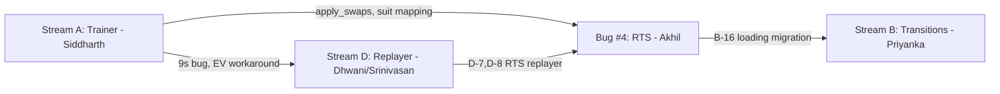

# Application Stabilization Plan - Bug Inventory (v2)

## Context

Andres reported 6 issues. This plan covers 3 active streams after scoping:

- Bug #2 (Hand Upload): Srinivasan owns (in progress)
- Bug #4 (RTS): Akhil owns (partially completed)
- Bug #5 (CSS/Responsive): Design team owns (removed from this plan)
- Debug panels (`TrainerDebugConsole`, `TrainerPerformancePanel`, `LoadingStateDebugPanel`): Internal-only, out of scope
- **Bug #1 (Values) -> Stream A**: Refocused on Trainer V1 vs V2 inconsistencies
- **Bug #3 (Transitions) -> Stream B**: Transitions, glitches, loading states
- **Bug #6 (Replayer) -> Stream D**: Replayer answer quality

**Affected variants:** Both Holdem and Omaha
**Timeline:** Ongoing

---

## Team and Assignments

| Developer                           | Primary Role               | Stream                   | Bandwidth                          |
| ----------------------------------- | -------------------------- | ------------------------ | ---------------------------------- |
| **Siddharth** (FE heavy + lite BE)  | Stream A owner             | Trainer Values           | Full                               |
| **Akhil** (BE heavy + lite FE)      | RTS owner (Bug #4)         | Stream B (RTS portion)   | Partial - RTS + transition overlap |
| **Priyanka** (FE heavy + lite BE)   | TBD                        | Stream B or D            | Full                               |
| **Dhwani** (FE lite + lite BE)      | TBD                        | Stream B or D            | Full                               |
| **Srinivasan** (BE heavy + lite FE) | Hand Upload owner (Bug #2) | Stream D (backend parts) | Partial                            |

**To decide:** Priyanka and Dhwani assignment to Stream B and D. Recommendation:

- **Priyanka -> Stream B** (transitions/loading states, very FE-heavy, 19 bugs)
- **Dhwani -> Stream D** (replayer frontend improvements, with Srinivasan supporting the backend fixes)

---

## Stream A: Trainer Values Inconsistent (Siddharth)

**Andres report:** "Values are inconsistent - EV and Strategies, Combos missing, Tables showing incorrect data"
**Refined scope:** V1 (preflop) gives different results than V2 for the same preflop spots. Postflop board randomization produces wrong or inconsistent results.

### How the Trainer works (context)

The trainer has two API code paths that feed the same V3 frontend layout:

- **V1 API** (`/trainer/generate-next-hand`): Preflop-only. Uses `generate_generic_action_combinations()` and `decode_range()` directly.
- **V2 API** (`/trainer/v2/generate-next-hand`): Multi-street. Uses `StrategyRequestProcessor` and `StrategyTreeNodeResolver` with pre-decoded arrays.

Both call the same `_generate_hand_response()` for EV/regret calculation, but with different inputs.

The frontend decides which API to call based on `fromStrategiesConfig`:

- No config (standalone trainer) -> V1 API
- Config present (entered from strategies page) -> V2 API

### DIVERGENCE POINT 1: Range Array Source (HIGH RISK)

#### BUG A-1: V1 and V2 decode ranges through different code paths

- **V1**: `spot_generation.py:217` calls `decode_range(tree_node['range'])` directly
- **V2**: `spot_generation.py:421` uses `data.get('rangeResult', [])` from `StrategyTreeNodeResolver`
- **What could differ**: The resolver may apply additional transformations (e.g., isomorphism mapping, sparse index expansion) that `decode_range()` alone does not
- **Impact**: Different range arrays -> different hand selection -> different combos shown to user
- **Files to audit**:
  - Backend: `trainer/views/spot_generation.py:207-217` (V1) vs `trainer/views/spot_generation.py:411-421` (V2)
  - Backend: `strategies/utils/unfold_range.py` (how resolver produces rangeResult)
- **Fix**: Trace both paths with the same tree node, compare output arrays byte-for-byte. Standardize on one path.

### DIVERGENCE POINT 2: Strategy/EV Decoding (MEDIUM RISK)

#### BUG A-2: V2 may use pre-decoded arrays while V1 always decodes fresh

- **V1**: Always calls `_decode_strategy_ev()` in `trainer_helper.py:366` to decompress brotli data from MongoDB
- **V2**: May use pre-decoded `actionProbs` and `expectedValue` from `StrategyTreeNodeResolver` (`trainer_helper.py:362-364`)
- **What could differ**: Pre-decoded arrays may have different float precision or rounding than fresh decode
- **Impact**: Slightly different EV values between V1 and V2 for the same spot
- **Files to audit**:
  - Backend: `trainer/utils/trainer_helper.py:349-371` (decode logic)
  - Backend: `strategies/services/strategy_treenode_resolver.py` (where pre-decoded arrays originate)
  - Backend: `strategies/utils/unfold_strategy.py` (`decode_strategy_ev()`)
- **Fix**: Verify both paths produce identical float arrays. If not, standardize on fresh decode or align precision.

### DIVERGENCE POINT 3: Pot Size and Rake (MEDIUM RISK)

#### BUG A-3: Pot size may differ between V1 and V2 due to config source

- **Backend**: Both V1 and V2 call `adjust_pot_size_with_rake()` in `trainer_helper.py:456-458`
- **V1**: Gets pot/rake from its own payload config
- **V2**: Gets pot/rake from `fromStrategiesConfig.gameConfig` which came from the strategy page
- **What could differ**: If game config (rake structure, blind levels) differs between V1 standalone config and V2 strategy-page config, pot sizes will differ
- **Frontend**: `FeedbackPanel.tsx:353-361` uses `record.potValue` for frontend regretPercent fallback, which may not match backend `pot_size`
- **Impact**: RegretPercent differs -> feedback labels (optimal/strong/weak/blunder) change for same spot
- **Files to audit**:
  - Backend: `trainer/utils/trainer_helper.py:456-458,532-548` (pot and regret calculation)
  - Frontend: `components/Trainer/FeedbackPanel.tsx:348-373` (display logic)
- **Fix**: Align pot size source. Always use backend `regretPercent` and remove frontend fallback.

### DIVERGENCE POINT 4: Frontend RegretPercent Fallback (HIGH RISK)

#### BUG A-4: Frontend calculates its own regretPercent differently than backend

- **Frontend**: `FeedbackPanel.tsx:350` uses backend `regretPercent` only for debug-access users
- **Frontend**: `FeedbackPanel.tsx:353-361` for non-debug users: `(bestEV - selectedEV) / potValue * 100`
- **Backend**: `trainer_helper.py:542-548`: `(best_ev_hand - weighted_ev_hand) / pot_size * 100` where `weighted_ev_hand = sum(strategy[a] * ev[a])`
- **What differs**: Frontend uses `selectedEV` (EV of the action the user picked), backend uses `weighted_ev_hand` (EV weighted by the full strategy mix). These are fundamentally different calculations.
- **Impact**: Non-debug users see a DIFFERENT regretPercent than debug users for the exact same action
- **Files**:
  - Frontend: `components/Trainer/FeedbackPanel.tsx:348-373`
- **Fix**: Remove frontend fallback entirely. Always use backend-provided `regretPercent`. If backend doesn't provide it, show "N/A" rather than a wrong number.

### DIVERGENCE POINT 5: Board Randomization for Postflop (HIGH RISK)

#### BUG A-5: Board randomization happens at wrong time with stale ref

- **Frontend**: `useTrainer.tsx:1348-1388` - `consumeFromBuffer()` function
- **What happens**: When `randomizeBoard === 'On'` and the trainer is in `postflop_only` mode:
  1. Hands are pre-generated in a buffer via the API
  2. Board cards are randomized AFTER generation, when the hand is consumed from the buffer
  3. Uses `isFirstHandRef.current` to skip randomization on first hand, but this ref may be stale
- **Impact**: 
  - Board cards may not match the strategy tree that was computed for the original board
  - EV values were computed for original board but user sees randomized board
  - `isFirstHandRef.current` staleness can cause first-hand randomization to be skipped or applied incorrectly
- **Files**:
  - Frontend: `components/Trainer/useTrainer.tsx:1348-1388`
  - Frontend: `components/Trainer/utils.ts:1428-1429` (`processBoardCards()`)
- **Fix**: Move board randomization to the backend (during generation, not consumption). This ensures the strategy tree matches the displayed board.

### DIVERGENCE POINT 6: Precision Strategy Swaps (LOW RISK for preflop, HIGH for postflop)

#### BUG A-6: apply_swaps failures are silently ignored

- **Backend**: `trainer/utils/trainer_helper.py:384-385,682-683`
- **What happens**: Two locations where `apply_swaps` is wrapped in bare `except Exception` that logs at DEBUG level and continues with unswapped values
- **Impact**: If precision strategy swap fails on a postflop spot, the user sees unswapped (wrong) combo ordering and potentially wrong EV values, with no indication anything went wrong
- **Files**:
  - Backend: `trainer/utils/trainer_helper.py:372-385` (single hand)
  - Backend: `trainer/utils/trainer_helper.py:676-683` (batch)
- **Fix**: Escalate to `logger.warning()`, add metrics/alerting. Consider returning an error to the frontend rather than silently serving wrong data.

### Also affects trainer (from previous audit)

#### BUG A-7: 9s Isomorphism Bug

- **Backend**: `strategies/utils/build_suit_map.py`
- **Evidence**: `strategies/tests/utils/test_apply_swaps_iso_consistency.py:220,251`
- **What happens**: Precision strategies use TURN suit map instead of FLOP suit map
- **Impact**: 9s incorrectly blocked on Turn/River boards - affects trainer postflop scenarios
- **Note**: Akhil may already be aware of this from RTS work. Siddharth should coordinate.

#### BUG A-8: Cache key collision across user roles

- **Backend**: `strategies/utils/cache_key.py:24`
- **Impact**: Trainer may serve cached strategy data from a different subscription tier
- **Fix**: Audit cache key to include role

#### BUG A-9: Spins game config deep `as any` chain

- **Frontend**: `components/Trainer/useTrainer.tsx:1583-1584`
- **What happens**: `spinsGamesConfig?.['preflop_only' as keyof typeof spinsGamesConfig] as any)?.variant?.holdem as any`
- **Impact**: If config structure changes, trainer silently uses wrong config for spins
- **Fix**: Define proper TypeScript interface

### Stream A Bug Summary

| Bug | Risk            | Type  | Description                                                |
| --- | --------------- | ----- | ---------------------------------------------------------- |
| A-1 | HIGH            | BE    | Range array decoded via different paths in V1 vs V2        |
| A-2 | MED             | BE    | Pre-decoded vs fresh-decoded strategy/EV arrays            |
| A-3 | MED             | BE+FE | Pot size differs between V1/V2 configs                     |
| A-4 | HIGH            | FE    | Frontend regretPercent uses different formula than backend |
| A-5 | HIGH            | FE    | Board randomization at wrong time with stale ref           |
| A-6 | HIGH (postflop) | BE    | apply_swaps failures silently ignored                      |
| A-7 | HIGH (postflop) | BE    | 9s isomorphism bug in suit mapping                         |
| A-8 | MED             | BE    | Cache key missing role                                     |
| A-9 | LOW             | FE    | Spins config type safety                                   |

**Priority order for Siddharth:**

1. A-4 (frontend regret fallback - quick win, removes a known wrong calculation)
2. A-1 (range divergence - root cause investigation, may explain most inconsistencies)
3. A-5 (board randomization timing - explains postflop inconsistencies)
4. A-3 (pot size alignment)
5. A-2 (EV decode precision)
6. A-6, A-7, A-8 (coordinate with Akhil)

---

## Stream B: Transitions and Glitches (Priyanka recommended, Akhil for RTS portion)

**Andres report:** "Transitions are not working and many glitches"
**Root cause:** Race conditions in async data fetching, missing loading states, Redux state not cleared on navigation, incomplete RTS loading migration.

### PAGE: Strategy Page (`/[game]/[gametype]/strategies`)

#### BUG B-1: Race Condition in useBuildQueryParams (CRITICAL)

- **Frontend**: `hooks/useBuildQueryParams.ts:251-1265`
- **What happens**: Multiple async API calls can overlap without cancellation when user rapidly changes inputs (street, board cards, action sequence)
- **Impact**: Out-of-order API responses overwrite newer data with stale data
- **Fix**: Implement request cancellation (AbortController) or request sequencing with version tokens

#### BUG B-2: Flash of Stale Data on Street Switch

- **Frontend**: `components/PlayerActions/PlayerActionsMenu.tsx:232-257`
- **What happens**: Stale-while-revalidate shows cached actions for ~200ms when switching streets
- **Impact**: User briefly sees wrong street's actions
- **Fix**: Clear cached data on street change, show skeleton instead

#### BUG B-3: CategoryDetails Transition Flash

- **Frontend**: `components/Strategy/CategoryDetails.tsx:363-387`
- **What happens**: 100ms minimum spinner too short; old range data flashes before spinner
- **Impact**: Brief flash of old category data during street transitions
- **Fix**: Increase minimum spinner duration, or clear old data before fetching

#### BUG B-4: TableViewActions Cache Race

- **Frontend**: `components/PlayerActions/TableViewActions.tsx:227-237,446-452`
- **What happens**: Cache update races with fresh data arrival; chip suppression may miss stale cases
- **Impact**: Brief flash of cached vs fresh chip animations
- **Fix**: Synchronize cache updates with data fetch completion

#### BUG B-5: Rapid Street Click Not Debounced

- **Frontend**: `components/PlayerActions/PlayerActionsMenu.tsx:313-393`
- **What happens**: `useEffect` for active keys fires on every street change without debouncing
- **Impact**: Rapid clicking causes UI flicker and inconsistent state
- **Fix**: Add debounce, disable buttons during transition

#### BUG B-6: EquityGraph Stale Data on Board Change

- **Frontend**: `hooks/useEquityGraph.ts:545-569`
- **What happens**: Old graph shown briefly when board cards change
- **Fix**: Clear data synchronously when board cards change

### PAGE: All Pages (Navigation)

#### BUG B-7: No Redux State Clearing on Route Change

- **Frontend**: `pages/_app.tsx:71-122`
- **What happens**: `NavigationLoader` only shows progress bar; no Redux state clearing
- **Impact**: Stale data persists across pages
- **Fix**: Add route change listener to clear relevant Redux slices

#### BUG B-8: Replayer State Persists

- **Frontend**: `pages/[game]/replayer/index.tsx:25-29`
- **Fix**: Clear replayer state on mount

#### BUG B-9: Strategy State Persists Across Tab Switches

- **Frontend**: `components/Strategy/index.tsx:241-251`
- **Fix**: Clear all strategy view state on tab switch, not just categories

### PAGE: Strategy Page - Missing Loading States

#### BUG B-10: No Skeleton for BoardsFiltersDropdown

- **Frontend**: `components/Strategy/index.tsx:32-34` - `loading: () => null`

#### BUG B-11: Missing Syntax Filter Loading Indicator

- **Frontend**: `components/Strategy/CategoryDetails.tsx:284`

#### BUG B-12: No BoardCategories Progressive Load Indicator

- **Frontend**: `components/Strategy/categories/BoardCategories.tsx:577-580`

#### BUG B-13: HandCategories Missing Loading States

- **Frontend**: `components/Strategy/categories/HandCategories.tsx:686-749`

#### BUG B-14: EquityGraph No Initial Skeleton

- **Frontend**: `components/Strategy/EquityGraph.tsx:278-279`

#### BUG B-15: RTK Query Loading State Inconsistency

- **Frontend**: `hooks/useEquityGraph.ts:28,638-643` - mixes `isLoading`, `isFetching`, `is202Pending` without priority

### RTS Portion (Akhil)

#### BUG B-16: 6 Legacy Loading State TODOs (RTS migration)

- `hooks/rts/useRTSSetup.ts:673`
- `hooks/useWebSocketActions.ts:82,197`
- `hooks/rts/messageDispatcher.ts:664,1233,1268`
- **What happens**: Dual loading state systems (legacy Redux + new useLoading hooks) may conflict
- **Fix**: Complete migration, remove legacy dispatches

### Layout Shift

#### BUG B-17: CategoryDetails Row Height Shift

- **Frontend**: `components/Strategy/CategoryDetails.tsx:1909-2025`

#### BUG B-18: PlayerActionsMenu Panel Expansion (no transition)

- **Frontend**: `components/PlayerActions/PlayerActionsMenu.tsx:313-393`

#### BUG B-19: TableViewActions Size Recalculation

- **Frontend**: `components/PlayerActions/TableViewActions.tsx:772-799`

### Stream B Bug Summary

| Priority | Bugs                 | Description                                      |
| -------- | -------------------- | ------------------------------------------------ |
| P0       | B-1                  | Race condition in query params (data overwrites) |
| P0       | B-2                  | Stale data flash on street switch                |
| P1       | B-7                  | Redux state not cleared on navigation            |
| P1       | B-5                  | Rapid street clicking not debounced              |
| P1       | B-16                 | RTS loading migration (Akhil)                    |
| P2       | B-3,B-4,B-6          | Transition flash, cache race, equity stale data  |
| P2       | B-10 to B-15         | Missing loading states/skeletons                 |
| P3       | B-8,B-9,B-17 to B-19 | State persistence, layout shifts                 |

---

## Stream D: Replayer Answers Quality (Dhwani recommended FE, Srinivasan partial BE)

**Andres report:** "Replayer is not amazing in terms of answers" + "EV values wrong or missing, analysis missing for some streets"
**Root cause:** Known backend TODOs in pot/rake calculation, silent exception handling, incomplete integrations.

### PAGE: Replayer / Sessions (`/[game]/sessions`)

#### BUG D-1: Pot Calculation Missing Blinds (CRITICAL)

- **Backend**: `replayer/views/replayer_next_actions_views.py:328`
- **Code**: `pot_so_far = 0  # TODO Add blinds`
- **What happens**: Pot starts at 0 instead of including posted blinds
- **Impact**: ALL EV calculations are off - pot size is wrong from the start. Likely the single biggest contributor to "values don't match other tools."
- **Fix**: Initialize `pot_so_far` with small blind + big blind amounts
- **Owner**: Srinivasan (backend)

#### BUG D-2: Rake Not Removed from Pot After Preflop (CRITICAL)

- **Backend**: `replayer/views/replayer_next_actions_views.py:338`
- **What happens**: Rake not subtracted from pot at preflop-to-flop transition
- **Impact**: Pot inflated for all post-flop streets -> wrong EV
- **Fix**: Implement site-specific rake deduction (PokerStars, Bodog, etc.)
- **Owner**: Srinivasan (backend)

#### BUG D-3: Silent Exception Handlers in Serializers (5 locations)

- **Backend**: `replayer/serializers/hands.py:858,866,874,882,891`
- **What happens**: `except Exception: return ''` silently swallows errors
- **Impact**: Missing data shown as empty instead of meaningful error
- **Fix**: Add `logger.exception()`, return meaningful defaults
- **Owner**: Srinivasan (backend)

#### BUG D-4: Straddle Not Handled

- **Backend**: `hand_analysis/services/ingestion.py:417`
- **Code**: `# todo straddle??`
- **Impact**: Straddle hands may have wrong pot sizes or fail to process
- **Owner**: Srinivasan (backend)

#### BUG D-5: Shared Hands Role Fetching Not Implemented

- **Backend**: `replayer/services/shared_hands.py:53`
- **What happens**: All shared hand viewers treated as free-tier
- **Impact**: Shared hands show limited analysis regardless of sharer's subscription
- **Owner**: Srinivasan (backend)

#### BUG D-6: Transaction Error Handling Ambiguity

- **Backend**: `hand_analysis/api/transactions.py:91-92,99-100`
- **What happens**: Generic `except Exception` returns 404 for both auth and not-found errors
- **Fix**: Separate exception types, return appropriate status codes
- **Owner**: Srinivasan (backend)

#### BUG D-7: RT Calculator Replayer Integration Incomplete

- **Backend**: `strategies/services/RT_calculator.py:1026,1067`
- **What happens**: Replayer bet box logic incomplete, bet values hardcoded (`bet1 = str(100)`)
- **Impact**: RTS calculations for replayer use wrong bet sizes
- **Owner**: Coordinate with Akhil (RTS owner)

#### BUG D-8: Active Player Wrong on River

- **Backend**: `strategies/utils/real_time_river_calc.py:102`
- **Code**: `# comment the 1 plus river action because active player are wrong if we add`
- **Impact**: River RTS uses wrong active player -> wrong EV
- **Owner**: Coordinate with Akhil (RTS owner)

#### BUG D-9: Hands Cache Type Safety (Frontend)

- **Frontend**: `hooks/useHandsCache.ts:28,46`
- **What happens**: `@ts-ignore` on RTK Query `originalArgs` access
- **Impact**: Wrong hand data could be cached if query shape changes
- **Owner**: Dhwani (frontend)

#### BUG D-10: EV Memory Workaround Active

- **Backend**: `strategies/utils/combos_df_river.py:621-622`
- **What happens**: Workaround frees/reloads Nash solver tree for correct EV (PGTCP-2247)
- **Impact**: Extra latency, root cause (PGT-726) unfixed
- **Cross-stream**: Also affects Stream A trainer EV. Coordinate with Siddharth.

### Stream D Bug Summary

| Priority | Bugs | Description                   | Owner          |
| -------- | ---- | ----------------------------- | -------------- |
| P0       | D-1  | Pot missing blinds            | Srinivasan     |
| P0       | D-2  | Rake not removed post-preflop | Srinivasan     |
| P0       | D-8  | Active player wrong on river  | Akhil (RTS)    |
| P1       | D-7  | Replayer bet box incomplete   | Akhil (RTS)    |
| P1       | D-3  | Silent exception handlers     | Srinivasan     |
| P2       | D-4  | Straddle handling             | Srinivasan     |
| P2       | D-5  | Shared hands role fetching    | Srinivasan     |
| P2       | D-10 | EV memory workaround          | Coordinate A+D |
| P3       | D-6  | Transaction error handling    | Srinivasan     |
| P3       | D-9  | Hands cache type safety       | Dhwani         |

---

## Cross-Stream Dependencies

**Key coordination points:**

- **Siddharth <-> Akhil**: 9s bug (A-7), apply_swaps (A-6), cache key (A-8) all touch strategy/RTS code Akhil knows
- **Akhil <-> Dhwani/Srinivasan**: D-7 (replayer bet box) and D-8 (active player) are RTS bugs that affect replayer
- **Siddharth <-> Srinivasan**: A-2/D-10 (EV memory workaround) affects both trainer and replayer

---

## Priority Matrix (All Streams)

### P0 - Fix First (data correctness, user trust)

- **D-1**: Pot missing blinds (Srinivasan)
- **D-2**: Rake not removed post-preflop (Srinivasan)
- **A-4**: Frontend regretPercent wrong formula (Siddharth)
- **A-1**: Range array divergence V1 vs V2 (Siddharth)
- **B-1**: Race condition causing data overwrites (Priyanka)
- **D-8**: Active player wrong on river (Akhil)

### P1 - Fix Next (most visible UX issues)

- **A-5**: Board randomization timing (Siddharth)
- **A-3**: Pot size alignment V1/V2 (Siddharth)
- **B-2**: Stale data flash on street switch (Priyanka)
- **B-7**: Redux state not cleared on nav (Priyanka)
- **B-16**: RTS loading migration (Akhil)
- **D-7**: Replayer bet box incomplete (Akhil)

### P2 - Polish

- **A-2**: EV decode precision (Siddharth)
- **A-6**: apply_swaps silent failure (Siddharth)
- **B-3 to B-6**: Transition flash, cache race, debounce (Priyanka)
- **B-10 to B-15**: Missing loading states (Priyanka)
- **D-3 to D-5**: Silent exceptions, straddle, shared hands (Srinivasan)

### P3 - Tech Debt

- **A-7 to A-9**: Isomorphism, cache key, type safety
- **B-8,B-9,B-17 to B-19**: State persistence, layout shifts
- **D-6,D-9,D-10**: Error handling, cache types, EV workaround

---

## Bug Count Summary

- **Stream A (Trainer Values)**: 9 bugs (A-1 through A-9)
- **Stream B (Transitions)**: 19 bugs (B-1 through B-19)
- **Stream D (Replayer)**: 10 bugs (D-1 through D-10)
- **Total**: 38 identified bugs across 3 streams

---

## Process

1. **Week 1**: Each stream starts with P0 bugs. Write failing tests or reproduction steps before fixing.
2. **Week 2+**: Move to P1. Small, focused PRs.
3. **Daily**: 10-min sync to flag cross-stream dependencies (especially Siddharth <-> Akhil, Akhil <-> Srinivasan).
4. **Validation**: Every fix verified against both Holdem AND Omaha.
5. **Andres validation**: After P0 fixes land, get Andres to re-test and confirm improvement.

---

## Open Items

- **Confirm Priyanka and Dhwani assignment** to Streams B and D
- **Get sample hands from Andres** to validate D-1 and D-2 fixes
- **Akhil to report RTS status** so Siddharth knows which A-7/A-6 fixes overlap

